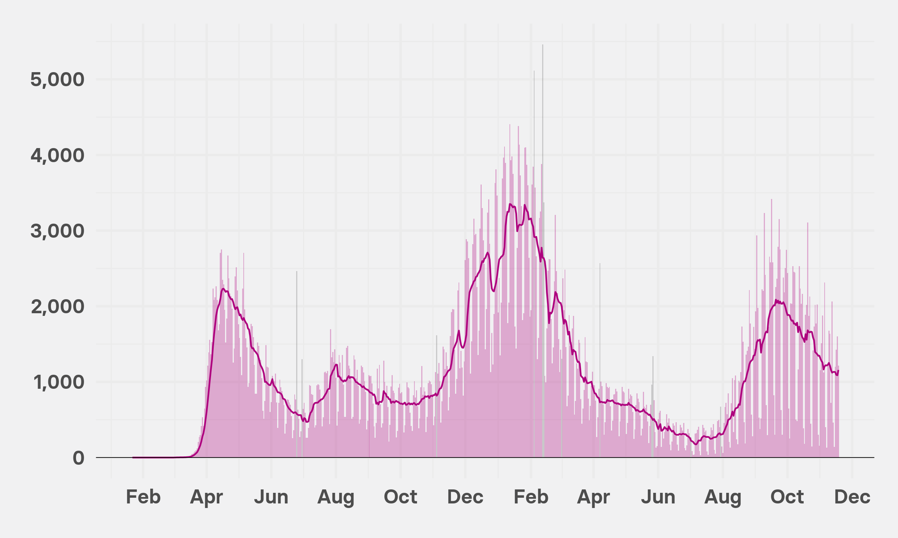

# Mapping Encampment Fires in Oakland
Sabrina Armaghan Kharrazi

## Under reported data

Organized datasets on fire incidents did not exist. Actual incident data and reports about the occurance of fires and the details that

Through public records requests I was able to collect data up through July 2021. I first had to geocode the data. I had attempted this in the past by hand so it was quite nice to learn a much for efficient and accurate way to standardize geodata. 

The Interactive Map I Created on Tableau:

<iframe title="% of preterm births by race and state" aria-label="Range Plot" id="datawrapper-chart-S7Fcq" src="https://public.tableau.com/views/EncampmentFireIncidents/Totalfiresmap2?:language=en-US&publish=yes&:display_count=n&:origin=viz_share_link" scrolling="no" frameborder="0" style="width: 1024; min-width: 100% !important; border: none;" height="768"></iframe>

Some further analysis of data based on districts:

<iframe title="% of preterm births by race and state" aria-label="Range Plot" id="datawrapper-chart-S7Fcq" src="https://public.tableau.com/views/EncampmentFiresPerDistrict/Sheet4?:language=en-US&publish=yes&:display_count=n&:origin=viz_share_link" scrolling="no" frameborder="0" style="width: 1024; min-width: 100% !important; border: none;" height="768"></iframe>

<iframe title="% of preterm births by race and state" aria-label="Range Plot" id="datawrapper-chart-S7Fcq" src="https://public.tableau.com/views/RiskbyNeighborhood/Sheet5?:language=en-US&publish=yes&:display_count=n&:origin=viz_share_link" scrolling="no" frameborder="0" style="width: 1024; min-width: 100% !important; border: none;" height="768"></iframe>

Followed by an embedded web page, using an iframe:

<iframe width="100%" height="600" frameborder="0" scrolling="no" src="https://oaklandca.nextrequest.com/requests/21-7640"></iframe>

And now an image:

